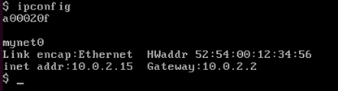
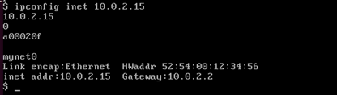
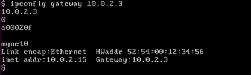
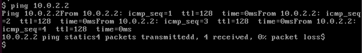
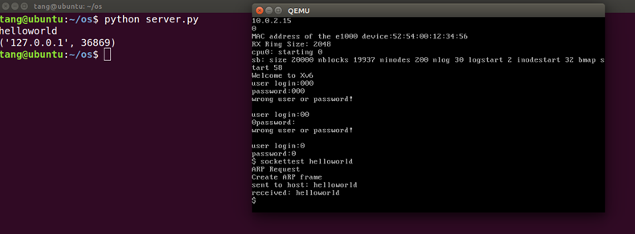
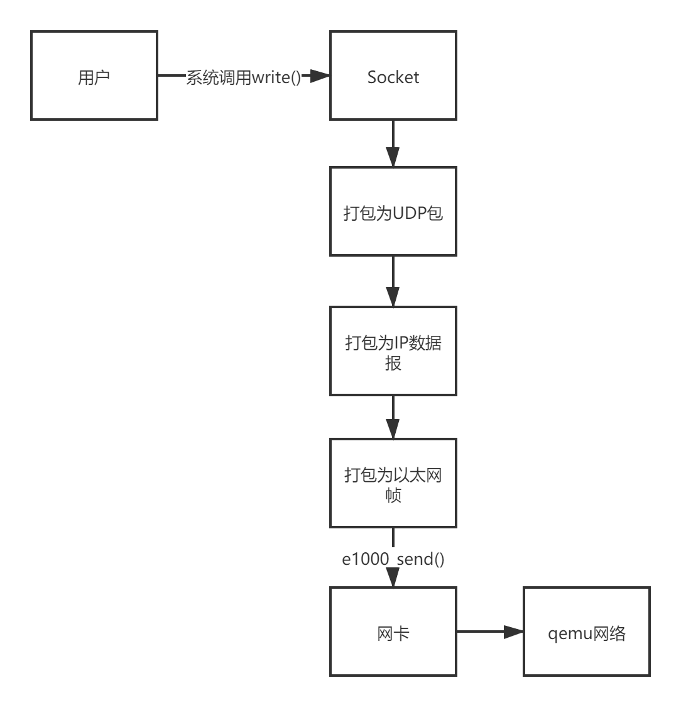
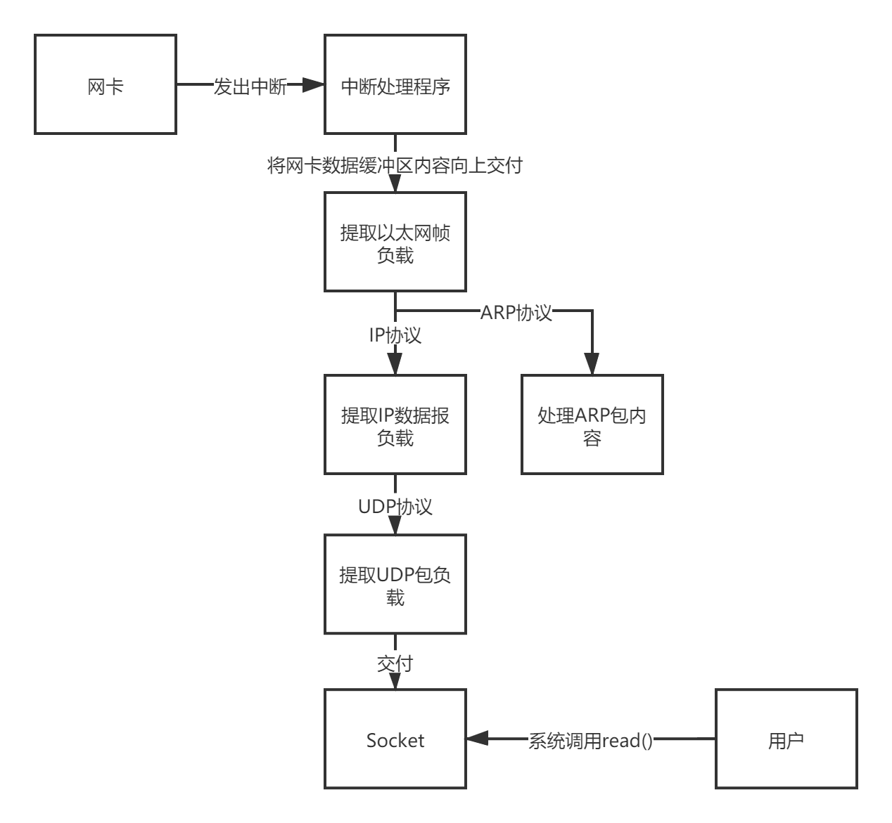

# SS.THU-Xv6
清华大学《操作系统》课程实验 Xv6 系统 | by 软件学院七字班

分支说明：
  networking-feature 组长 唐建宇

## 一、完成情况：

#### 整合：

- E1000网卡驱动
- ARP协议支持
- ICMP协议支持

#### 改进和完善：

- 实现了中断驱动方式的网卡控制
- 实现了Ethernet/IP/UDP 协议栈
- 按照互联网五层模型重构了代码
- 实现了完整的UDP socket系统调用
- 实现了ipconfig命令、ping命令、sockettest命令

## 二、测试方法

- ipconfig

  - 直接执行 ipconfig
  
    
  
  - 修改本机ip ipconfig inet 10.0.2.15
  
    
  
  - 修改网关ip ipconfig gateway 10.0.2.2
  
    
  
- arptest

  直接执行 arptest 10.0.2.2
  
- ping

  在host机启动python ping_server_simulator.py，在qemu中输入ping 10.0.2.2 即可
  
  
  
- sockettest

  在host机启动python server.py，在qemu中输入sockettest content 即可，content为一段不含空格字符串
  
  

## 三、实现原理

#### 1.E1000网卡驱动

**初始化**

使用e1000_init()初始化相关寄存器与缓冲区

**发送**

e1000_send()接口将数据放入缓冲区并发送至链路

**接收**

1. 网卡收到数据发出中断
2. 中断处理程序调用e1000_recv()读取缓冲区数据
3. 中断处理程序向协议栈交付数据

#### 2.按照互联网五层模型组织的协议栈

- 链路层

  Ethernet协议、ARP协议

- 网络层

  IP协议、ICMP协议

- 传输层

  UDP协议

根据上述协议实现了不同层数据的封包（发送方）和解析、处理（接收方）。

#### 3.Socket实现

**socket即文件**

修改了文件系统中文件结构体，加入了表示为socket的枚举类型以及相关数据域。

通过sockalloc()方法创建socket并返回其文件描述符fd。

**系统调用**

实现了与文件相同的系统调用：

- read()读取socket的队列中第一个UDP包（阻塞）
- write()发送一个UDP包
- close()关闭socket并释放内存

**维护**

通过维护系统sockets链表维护所有socket，将socket作为用户和协议栈的接口，即用户只与socket交互，不直接与协议栈发生联系；同样，协议栈的交付、发送也只与socket联系；同时，socket中维护了收到udp包的队列供用户程序读取。

#### 4.整体流程

**发送**

**接收**

## 四、难点与解决方案

#### 1.网卡的中断

这是6字班代码留下的bug，只能通过轮询方式接收消息，无法触发中断。我们仔细查阅了intel e1000网卡的开发文档以及网上一些开源代码，最终发现是部分寄存器没有初始化导致的；将其初始化后，即可正常触发中断。

#### 2.ipconfig命令的实现

6字班代码中并没有保存ip地址、mac地址以及他们的对应，因此完全没有办法供用户态程序调用，为此，我们将本地及网关的IP地址和MAC地址存储在网卡驱动e1000结构体中，其中本地MAC地址在启动时初始化，本地和网关IP通过调用ipconfig命令进行设置，设置网关IP后系统会自动发送ARP请求来获取网关的MAC地址，也会自动响应外界的ARP请求。
在network.c中提供了发送和接收链路帧与IP数据报的接口，在发送和接收时会使用上述结构体中的IP和MAC数据，从而实现网络地址的设置和调用。

#### 3.socket框架的搭建

使用socket维护收发的包对于中断驱动方式而言是自然的选择（不需要轮询导致用户不用关心什么时候收到了包，等socket交付即可）。在搭建整个框架的过程中，我们以接收队列、地址、端口等信息组成了socket结构体；系统维护所有socket的链表来实现了这个框架。socket与用户和协议栈都以规定的接口进行交互。

## 五、分工

骆炳君：修改网卡驱动、实现链路层、网络层协议、ipconfig命令

唐建宇：实现传输层协议、socket系统、sockettest命令

汪颖祺：实现应用层、ping命令